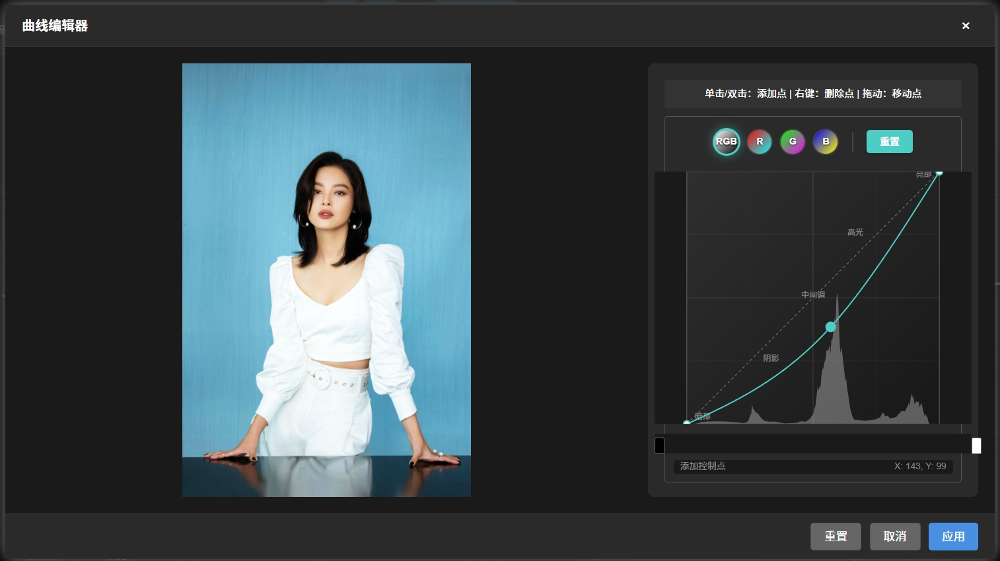
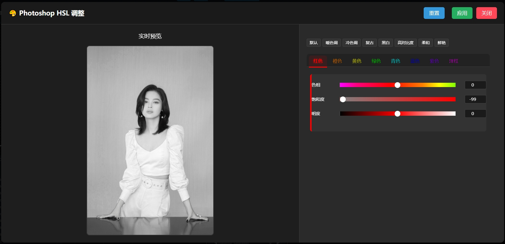
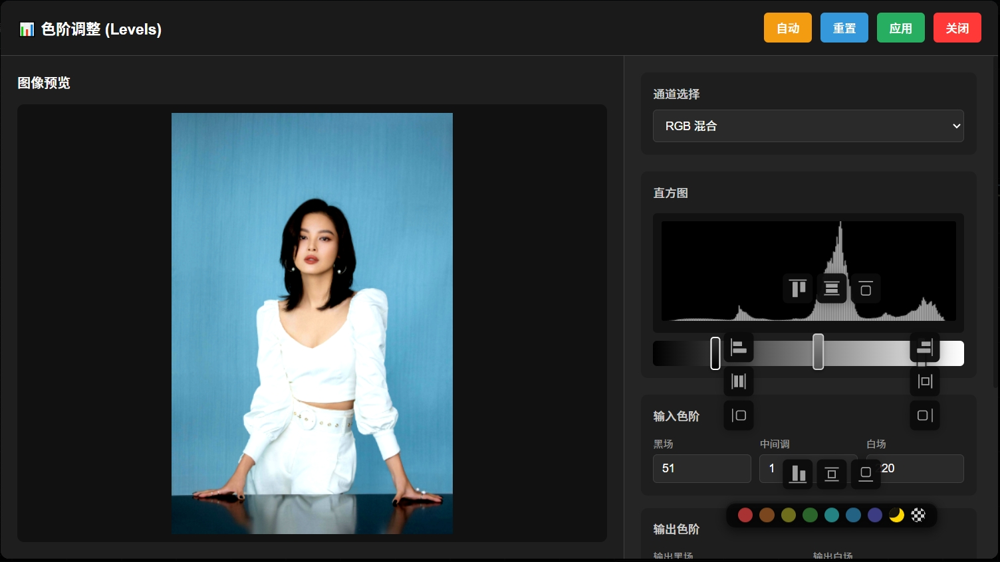
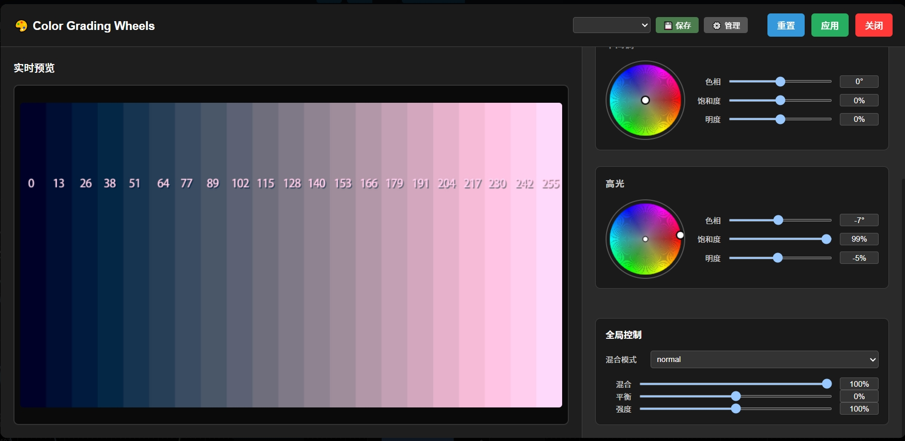
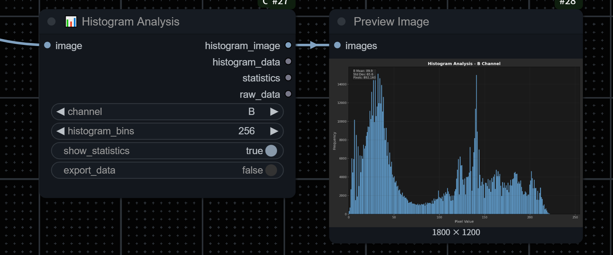
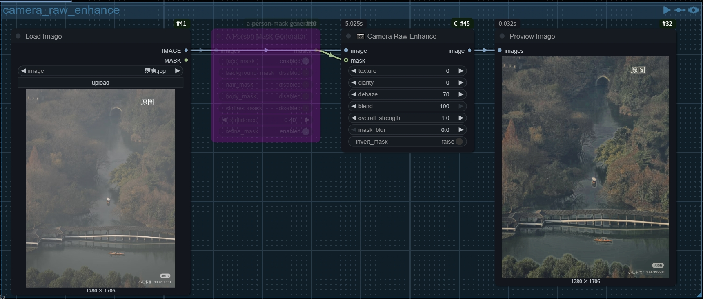

# ComfyUI-Curve

<!-- 语言切换 | Language Switch -->
<div align="center">
  <a href="#中文">中文</a> | <a href="#english">English</a>
</div>

---

## 中文

ComfyUI专业色彩调整扩展，提供类似Photoshop的曲线、HSL、色阶调整功能，支持70+种预设风格、高级遮罩和Lightroom风格的色彩分级功能。

### 🌟 主要功能

项目介绍视频：https://www.bilibili.com/video/BV1QuMFzRE5i/

#### 🎨 曲线调整 (Photoshop Curve)

- 类似Photoshop的专业曲线调整，支持多种插值方式
- **双击节点进入实时调整界面**：在弹出窗口中直接拖动控制点，即刻观察图像变化效果
- 实时曲线图表，可选直方图背景显示
- 支持RGB整体或单独R/G/B通道调整
- 可调曲线效果强度（0-200%）
- **弹窗内调整立即应用**：所有曲线修改无需重新运行工作流即可在弹窗内实时查看效果

#### 🎭 HSL调整 (Photoshop HSL)

- 精准控制8个颜色通道：红、橙、黄、绿、浅绿、蓝、紫、品红
- 每个颜色可独立调整色相、饱和度、明度
- **双击节点打开HSL调整弹窗**：在弹出窗口中滑动调节器立即显示颜色变化效果，所见即所得
- 支持遮罩和羽化效果
- **弹窗内实时交互响应**：在弹出界面中调整任何HSL参数都能即时反映在预览图像上

#### 🎚️ 色阶调整 (Photoshop Levels)

- **双击节点打开Photoshop风格色阶调整界面**：专业三点控制（黑场、灰场、白场）
- **实时预览调整**：拖动滑块即时查看色阶调整效果
- **自动色阶功能**：一键自动优化图像对比度和色阶分布
- **自动对比度功能**：智能增强图像对比度
- **精确数值控制**：输入/输出黑白场点、伽马值精确调整
- **直方图背景显示**：在色阶界面中显示实时直方图，便于精确调整

#### 🎨 色彩分级 (Color Grading)

- **双击节点打开Lightroom风格的色彩分级界面**：专业三色轮设计（阴影、中间调、高光）
- **实时交互式色轮操作**：直接在色轮上拖拽调整色相和饱和度，实时预览效果
- **负饱和度完全去饱和**：-100饱和度实现完全灰度效果，不再产生偏色
- **Shift键负饱和度支持**：按住Shift键在色轮上操作可设置负饱和度值
- **精确的Lab色彩空间处理**：使用专业Lab色彩算法，确保色彩准确性
- **多种混合模式**：normal、multiply、screen、overlay、soft_light等专业混合选项
- **区域智能遮罩**：基于亮度的平滑过渡遮罩，精确控制阴影、中间调、高光区域
- **强度控制**：可调整整体效果强度（0-200%）

#### 🔍 直方图分析 (Histogram Analysis)

- 专业的图像直方图分析节点
- **详细的统计信息**：平均值、中位数、标准差等图像统计数据
- **像素分布可视化**：清晰显示图像的亮度和颜色分布情况
- **多通道支持**：支持RGB整体或单独R/G/B通道分析
- 为其他调整节点提供数据参考

#### 🎯 Camera Raw增强 (Camera Raw Enhance)

- 集成Adobe Camera Raw的三个核心增强功能
- **纹理 (Texture)**：增强中等大小细节的对比度，范围-100到100
- **清晰度 (Clarity)**：增强中间调对比度，让图像更锐利，范围-100到100
- **去薄雾 (Dehaze)**：减少或增加大气雾霾效果，范围-100到100
- 支持混合控制和整体强度调节
- 包含完整的前端JavaScript界面，支持实时预览

#### 🖼️ 预设风格 (Curve Preset)
- 70+种专业调色预设
- 涵盖人像、风景、电影、复古等多种风格
- 一键应用，快速实现专业调色效果

#### 🎯 高级遮罩支持
- 选择性调整特定区域
- 遮罩边缘羽化，自然过渡
- 支持遮罩反转

#### 💡 交互式编辑
- **双击节点打开专业调整弹窗**，在弹出界面中实时预览调整效果
- **弹窗内所有调整参数实时同步**，无需重新运行工作流
- **零延迟反馈**：在弹出窗口中调整参数时图像实时更新，像使用专业图像编辑软件一样流畅
- 支持曲线、HSL、色阶和色彩分级节点的交互式编辑
- 类似Photoshop的专业编辑体验

### 📥 安装方法

#### Git克隆（推荐）
```bash
cd ComfyUI/custom_nodes
git clone https://github.com/your-username/ComfyUI-Curve.git
```

#### 手动下载
1. 下载ZIP文件
2. 解压到 `ComfyUI/custom_nodes/ComfyUI-Curve`
3. 重启ComfyUI

#### 依赖要求
- torch>=1.9.0
- numpy>=1.21.0
- scipy>=1.7.0

### 📝 使用技巧

#### 如何使用弹窗实时预览功能

1. **曲线调整实时预览**：
   - 在工作流中添加Photoshop Curve节点
   - 连接输入图像和遮罩（可选）
   - **双击节点**打开调整弹窗
   - 此时您可以看到弹出窗口中的图像预览区域和曲线编辑区域
   - 在弹窗内曲线上添加控制点：**点击曲线**添加新控制点
   - 在弹窗内拖动控制点：**左键按住并拖动**控制点，观察图像实时变化
   - 在弹窗内删除控制点：**右键点击**控制点
   - 在弹窗内切换通道：点击**RGB、R、G、B**按钮切换不同通道曲线
   - 在弹窗内调整强度：移动**强度滑块**即时查看不同强度效果
   - 完成后点击弹窗中的**应用**按钮，参数将自动同步到节点

2. **HSL调整实时预览**：
   - 在工作流中添加Photoshop HSL节点
   - 连接输入图像和遮罩（可选）
   - **双击节点**打开HSL调整弹窗
   - 在弹出窗口中选择您想调整的颜色通道（红、橙、黄等）
   - 在弹窗内移动**色相滑块**：左右拖动调整该颜色的色相值
   - 在弹窗内移动**饱和度滑块**：左右拖动调整该颜色的饱和度
   - 在弹窗内移动**明度滑块**：左右拖动调整该颜色的明度
   - 弹窗内每个滑块调整都会**实时更新**预览图像
   - 完成后点击弹窗中的**应用**按钮，参数将自动同步到节点

3. **Color Grading调整实时预览**：
   - 在工作流中添加Color Grading节点
   - 连接输入图像和遮罩（可选）
   - **双击节点**打开色彩分级调整弹窗
   - 在弹出窗口中您将看到三个色轮：阴影、中间调和高光
   - **色轮操作技巧**：
     - 普通点击拖拽：设置正饱和度（增强颜色）
     - **按住Shift键拖拽**：设置负饱和度（去饱和效果）
     - 色轮指示器颜色：白色=正饱和度，灰色=负饱和度
   - **饱和度滑块**：-100到+100范围
     - 正值：增强该区域的颜色饱和度
     - 负值：降低该区域的颜色饱和度（朝向灰度）
     - -100：该区域完全去饱和变为灰度
   - 使用亮度滑块调整各区域明暗程度
   - 选择混合模式控制颜色应用方式
   - 调整整体强度控制效果程度
   - 预览窗口实时更新，所见即所得
   - 完成后点击弹窗中的**应用**按钮，参数将自动同步到节点


5. **色阶调整实时预览**：
   - 在工作流中添加Photoshop Levels节点
   - 连接输入图像和遮罩（可选）
   - **双击节点**打开色阶调整弹窗
   - 在弹出窗口中您将看到带直方图背景的色阶调整界面
   - **三点控制调整**：
     - 左侧滑块：调整黑场点（输入暗部范围）
     - 中间滑块：调整伽马值（中间调亮度）
     - 右侧滑块：调整白场点（输入亮部范围）
   - **输出色阶调整**：设置输出的黑白场范围
   - **自动功能**：
     - 点击"自动色阶"按钮自动优化图像对比度
     - 点击"自动对比度"按钮智能增强对比度
   - 所有调整都会在预览窗口中实时显示效果
   - 完成后点击弹窗中的**应用**按钮，参数将自动同步到节点

4. **弹窗预览界面通用操作**：
   - **放大/缩小预览**：在弹窗内使用鼠标滚轮或+/-按钮
   - **平移预览**：在弹窗内按住中键并拖动
   - **对比原图**：在弹窗内按住空格键查看原始图像，释放返回调整后效果
   - **重置参数**：点击弹窗内的重置按钮恢复默认设置
   - **取消编辑**：点击弹窗内的取消按钮放弃当前更改
   - **应用编辑**：点击弹窗内的应用按钮确认更改并同步到节点

#### 曲线调整技巧
- S形曲线：增加对比度
- 反S形：减少对比度
- 上移曲线：提亮图像
- 下移曲线：压暗图像
- 曲线格式：`x1,y1;x2,y2;x3,y3`（例如：`0,0;128,150;255,255`）
- **实时预览技巧**：在弹窗中使用多个控制点微调局部区域，观察实时效果找到最佳调整

#### HSL调整技巧
- 肤色调整：微调红橙色相和饱和度
- 天空增强：调整蓝色和浅绿通道
- 叶绿增强：调整绿色和黄色通道
- 日落效果：增强橙色和品红通道
- **实时预览技巧**：在弹窗中逐个通道调整并观察实时效果，找到理想的颜色平衡点

#### 直方图分析技巧
- **亮度分布判断**：
  - 左侧堆积：图像偏暗，考虑提亮处理
  - 右侧堆积：图像偏亮，考虑压暗处理
  - 中间集中：对比度较低，需要增强对比
  - 双峰分布：图像层次丰富，对比度良好
- **颜色通道分析**：
  - R/G/B通道偏移：判断色偏问题
  - 某通道过度集中：该颜色饱和度可能过高或过低
- **统计数据应用**：
  - 平均值：判断整体亮度水平
  - 标准差：评估图像对比度和层次
  - 中位数：了解像素分布的平衡点

#### 色阶调整技巧
- **三点控制策略**：
  - 黑场点：设置图像中最暗部分的位置，影响阴影细节
  - 白场点：设置图像中最亮部分的位置，影响高光细节
  - 伽马值：调整中间调亮度，<1变亮，>1变暗
- **自动功能使用**：
  - 自动色阶：适合欠曝或过曝图像的快速修正
  - 自动对比度：适合对比度不足的平淡图像
- **输出色阶控制**：
  - 压缩动态范围：适合打印输出或特殊效果
  - 扩展输出范围：增强图像对比度
- **结合直方图调整**：观察直方图变化，避免过度调整导致的色阶断层

#### Color Grading技巧
- **饱和度调整技巧**：
  - 正饱和度（1-100）：增强该区域的颜色鲜艳度
  - 负饱和度（-1到-100）：降低该区域的颜色鲜艳度，朝向灰度
  - 全区域-100饱和度：实现完全灰度效果，适合制作黑白照片基底
  - 选择性去饱和：只对特定区域（如阴影或高光）设置负饱和度
- **色轮操作技巧**：
  - 普通拖拽：调整色相和正饱和度
  - Shift+拖拽：调整色相和负饱和度（去饱和方向）
  - 观察指示器：白色圆点=正饱和度，灰色圆点=负饱和度
- **风格化调色**：
  - 电影风格：阴影区域添加蓝色，高光添加暖色
  - 复古效果：阴影添加青色，高光添加橙黄色  
  - 日落效果：阴影添加紫色，高光添加橙色
  - 冷调风格：所有区域朝向蓝青色调整
  - 暖调风格：所有区域朝向橙黄色调整
- **混合模式应用**：
  - soft_light：自然的颜色增强，适合微调
  - overlay：强烈的对比增强，适合戏剧效果
  - multiply：压暗效果，适合营造神秘氛围
  - screen：提亮效果，适合梦幻风格

#### Camera Raw增强技巧
- **纹理调整**：
  - 正值（1-100）：增强细节，让图像更有质感
  - 负值（-1到-100）：柔化细节，适合人像皮肤处理
- **清晰度调整**：
  - 正值：增强中间调对比度，让图像更锐利
  - 负值：减少中间调对比度，产生柔焦效果
- **去薄雾调整**：
  - 正值：减少雾霾，增强清晰度和色彩饱和度
  - 负值：增加雾霾效果，营造朦胧氛围
- **组合使用建议**：
  - 风景照片：纹理+10，清晰度+20，去薄雾+15
  - 人像照片：纹理-10，清晰度+5，去薄雾+5
  - 建筑摄影：纹理+20，清晰度+25，去薄雾+10

#### 遮罩应用技巧
- 人像皮肤：建议2-4像素羽化
- 天空背景：建议5-10像素羽化
- 物体边缘：建议1-3像素羽化
- 大面积区域：建议8-15像素羽化

### 🆕 最近更新

#### 2025-06-22 - 项目全面模块化重构
- **架构升级**：将3591行的单体nodes.py文件重构为清晰的模块化架构
- **代码组织**：创建了6个功能模块（core、photoshop、lightroom、camera_raw、effects、analysis、presets）
- **可维护性提升**：每个节点独立文件，便于维护和扩展
- **代码复用**：通过BaseImageNode基类消除重复代码
- **性能优化**：修复了PhotoshopLevelsNode的预览问题，添加了直接预览功能

#### 2025-06-21 - 新增Camera Raw增强节点
- 集成Adobe Camera Raw的三个核心增强功能：纹理、清晰度、去薄雾
- 支持-100到100的调整范围，提供专业级图像增强效果
- 包含完整的前端实时预览界面

#### Color Grading功能重大改进
- **修复饱和度-100偏色问题**：现在-100饱和度能实现完全灰度效果，不再产生青色等偏色
- **新增负饱和度支持**：-100到+100完整饱和度范围，负值实现去饱和效果
- **Shift键交互增强**：按住Shift键在色轮上操作可设置负饱和度值  
- **色轮视觉指示器**：白色指示器表示正饱和度，灰色指示器表示负饱和度
- **Lab色彩空间优化**：修正了Lab中性值计算，确保完全去饱和时的色彩准确性
- **全局去饱和检测**：当所有区域都设为-100饱和度时，自动应用全局灰度转换
- **改进的亮度遮罩算法**：使用sigmoid函数创建平滑过渡，更接近Lightroom效果
- **多种混合模式支持**：添加multiply、screen、overlay、soft_light等专业混合选项
- **实时预览性能优化**：提升弹窗内预览响应速度和准确性

### 📄 许可证

MIT许可证 - 查看 [LICENSE](LICENSE) 文件。

---

## English

Professional color adjustment extension for ComfyUI with Photoshop-like Curve, HSL, and Levels adjustment functionality, 70+ preset styles, advanced mask support, and Lightroom-style Color Grading. **The standout feature is the ability to double-click nodes to open popup windows with real-time preview that allows you to color grade with the precision of professional image editing software.**

### 🌟 Key Features

#### 🎨 Curve Adjustment (Photoshop Curve)

- Professional Photoshop-style curve adjustment with multiple interpolation methods
- **Double-click node for real-time adjustment interface**: Directly drag control points in the popup window and instantly see image changes
- Real-time curve chart with optional histogram background display
- Support for RGB overall or individual R/G/B channel adjustment
- Adjustable curve effect intensity (0-200%)
- **Popup window adjustments apply immediately**: All curve modifications can be viewed in real-time within the popup without re-running the workflow

#### 🎭 HSL Adjustment (Photoshop HSL)

- Precise control over 8 color channels: Red, Orange, Yellow, Green, Cyan, Blue, Purple, Magenta
- Independent adjustment of Hue, Saturation, and Lightness for each color
- **Double-click node to open HSL adjustment popup**: Slide controllers in the popup window to immediately see color change effects, WYSIWYG
- Support for masks and feathering effects
- **Real-time interactive response in popup**: Any HSL parameter adjustment in the popup interface instantly reflects in the preview image

#### 🎚️ Levels Adjustment (Photoshop Levels)

- **Double-click node for Photoshop-style levels adjustment interface**: Professional three-point control (black point, gray point, white point)
- **Real-time preview adjustment**: Drag sliders to instantly see levels adjustment effects
- **Auto levels function**: One-click automatic optimization of image contrast and level distribution
- **Auto contrast function**: Intelligent image contrast enhancement
- **Precise numerical control**: Accurate adjustment of input/output black/white points and gamma values
- **Histogram background display**: Shows real-time histogram in levels interface for precise adjustments

#### 🎨 Color Grading

- **Double-click for Lightroom-style color grading interface**: Professional three-wheel design (shadows, midtones, highlights)
- **Real-time interactive color wheel operation**: Directly drag on wheels to adjust hue and saturation with instant preview
- **Full desaturation at -100 saturation**: -100 saturation achieves complete grayscale effect without color cast
- **Shift key for negative saturation**: Hold Shift while operating on color wheels to set negative saturation values
- **Precise Lab color space processing**: Professional Lab color algorithm ensures color accuracy
- **Multiple blend modes**: normal, multiply, screen, overlay, soft_light and other professional blending options
- **Intelligent region masking**: Smooth transition masks based on luminance for precise control of shadows, midtones, highlights
- **Strength control**: Adjustable overall effect intensity (0-200%)

#### 📊 Histogram Analysis

- Professional image histogram analysis node
- **Detailed statistical information**: Mean, median, standard deviation and other image statistics
- **Pixel distribution visualization**: Clear display of image brightness and color distribution
- **Multi-channel support**: Supports RGB overall or individual R/G/B channel analysis
- Provides data reference for other adjustment nodes

#### 🎯 Camera Raw Enhance

- Integrates three core Adobe Camera Raw enhancement features
- **Texture**: Enhances medium-sized detail contrast, range -100 to 100
- **Clarity**: Enhances midtone contrast for sharper images, range -100 to 100
- **Dehaze**: Reduces or adds atmospheric haze effect, range -100 to 100
- Supports blend control and overall strength adjustment
- Includes complete frontend JavaScript interface with real-time preview

#### 🖼️ Preset Styles (Curve Preset)
- 70+ professional color grading presets
- Covers portrait, landscape, cinematic, vintage, and more
- One-click application for quick professional color grading

#### 🎯 Advanced Mask Support
- Selective adjustment of specific areas
- Mask edge feathering for natural transitions
- Support for mask inversion

#### 💡 Interactive Editing
- **Double-click nodes to open professional adjustment popup** with real-time preview in the window
- **All adjustment parameters in the popup sync instantly** without re-running the workflow
- **Zero-delay feedback**: Images update in real-time in the popup window as parameters are adjusted, as smooth as using professional image editing software
- Supports interactive editing for Curve, HSL, Levels and Color Grading nodes
- Professional editing experience similar to Photoshop and Lightroom

### 📥 Installation

#### Git Clone (Recommended)
```bash
cd ComfyUI/custom_nodes
git clone https://github.com/your-username/ComfyUI-Curve.git
```

#### Manual Download
1. Download ZIP file
2. Extract to `ComfyUI/custom_nodes/ComfyUI-Curve`
3. Restart ComfyUI

#### Dependencies
- torch>=1.9.0
- numpy>=1.21.0
- scipy>=1.7.0

### 📝 Usage Tips

#### How to Use Popup Real-time Preview

1. **Curve Adjustment Real-time Preview**:
   - Add Photoshop Curve node to your workflow
   - Connect input image and mask (optional)
   - **Double-click the node** to open the adjustment popup window
   - You'll see the image preview area and curve editing area in the popup
   - Add control points in the popup: **Click on the curve** to add a new control point
   - Move control points in the popup: **Left-click and drag** a control point to see real-time image changes
   - Delete control points in the popup: **Right-click** on a control point
   - Switch channels in the popup: Click on **RGB, R, G, B** buttons to toggle different channel curves
   - Adjust intensity in the popup: Move the **intensity slider** to instantly see different strength effects
   - When finished, click **Apply** in the popup window and parameters will automatically sync to the node

2. **HSL Adjustment Real-time Preview**:
   - Add Photoshop HSL node to your workflow
   - Connect input image and mask (optional)
   - **Double-click the node** to open the HSL adjustment popup window
   - In the popup window, select the color channel you want to adjust (Red, Orange, Yellow, etc.)
   - Move **Hue slider** in the popup: Drag left/right to adjust the hue value for that color
   - Move **Saturation slider** in the popup: Drag left/right to adjust the saturation
   - Move **Lightness slider** in the popup: Drag left/right to adjust the lightness
   - Each slider adjustment in the popup will **update the preview image in real-time**
   - When finished, click **Apply** in the popup window and parameters will automatically sync to the node

3. **Color Grading Real-time Preview**:
   - Add Color Grading node to your workflow
   - Connect input image and mask (optional)
   - **Double-click the node** to open the color grading popup window
   - In the popup, you'll see three color wheels for shadows, midtones, and highlights
   - **Color wheel operation techniques**:
     - Normal click and drag: Set positive saturation (enhance colors)
     - **Hold Shift key and drag**: Set negative saturation (desaturation effect)
     - Wheel indicator colors: White circle = positive saturation, Gray circle = negative saturation
   - **Saturation sliders**: -100 to +100 range
     - Positive values: Enhance color saturation in that region
     - Negative values: Reduce color saturation in that region (toward grayscale)
     - -100: Complete desaturation of that region to grayscale
   - Use luminance sliders to adjust brightness levels for each region
   - Select blend mode to control how colors are applied
   - Adjust overall strength to control effect intensity
   - Preview window updates in real-time, showing exactly what you'll get
   - When finished, click **Apply** in the popup window and parameters will automatically sync to the node


5. **Levels Adjustment Real-time Preview**:
   - Add Photoshop Levels node to your workflow
   - Connect input image and mask (optional)
   - **Double-click the node** to open levels adjustment popup
   - In the popup window you'll see levels adjustment interface with histogram background
   - **Three-point control adjustment**:
     - Left slider: Adjust black point (input shadow range)
     - Middle slider: Adjust gamma value (midtone brightness)
     - Right slider: Adjust white point (input highlight range)
   - **Output levels adjustment**: Set output black and white point range
   - **Auto functions**:
     - Click "Auto Levels" button to automatically optimize image contrast
     - Click "Auto Contrast" button for intelligent contrast enhancement
   - All adjustments display effects in real-time in the preview window
   - When finished, click **Apply** in the popup window and parameters will automatically sync to the node

4. **Popup Preview Interface Common Operations**:
   - **Zoom in/out preview**: Use mouse wheel or +/- buttons in the popup
   - **Pan preview**: Hold middle mouse button and drag in the popup
   - **Compare with original**: Hold spacebar in the popup to view original image, release to return to adjusted effect
   - **Reset parameters**: Click the reset button in the popup to restore default settings
   - **Cancel editing**: Click cancel button in the popup to discard current changes
   - **Apply editing**: Click apply button in the popup to confirm changes and sync to node

#### Curve Adjustment Tips
- S-curve: Increases contrast
- Inverse S-curve: Reduces contrast
- Moving curve up: Brightens image
- Moving curve down: Darkens image
- Curve format: `x1,y1;x2,y2;x3,y3` (e.g., `0,0;128,150;255,255`)
- **Real-time preview tip**: Use multiple control points in the popup window to fine-tune local areas, observe real-time effects to find optimal adjustments

#### HSL Adjustment Tips
- Skin tone adjustment: Fine-tune Red and Orange hue and saturation
- Sky enhancement: Adjust Blue and Cyan channels
- Foliage enhancement: Adjust Green and Yellow channels
- Sunset effect: Enhance Orange and Magenta channels
- **Real-time preview tip**: In the popup window, adjust channels one by one while observing real-time effects to find the ideal color balance

#### Histogram Analysis Tips
- **Brightness distribution assessment**:
  - Left-side clustering: Image is too dark, consider brightening
  - Right-side clustering: Image is too bright, consider darkening
  - Center concentration: Low contrast, needs contrast enhancement
  - Bimodal distribution: Rich image layers with good contrast
- **Color channel analysis**:
  - R/G/B channel shifts: Identify color cast issues
  - Excessive concentration in one channel: Color saturation may be too high or low
- **Statistical data application**:
  - Mean: Judge overall brightness level
  - Standard deviation: Evaluate image contrast and tonal range
  - Median: Understand pixel distribution balance point

#### Levels Adjustment Tips
- **Three-point control strategy**:
  - Black point: Set position of darkest part in image, affects shadow detail
  - White point: Set position of brightest part in image, affects highlight detail
  - Gamma value: Adjust midtone brightness, <1 brightens, >1 darkens
- **Auto function usage**:
  - Auto Levels: Suitable for quick correction of underexposed or overexposed images
  - Auto Contrast: Suitable for flat images lacking contrast
- **Output levels control**:
  - Compress dynamic range: Suitable for print output or special effects
  - Expand output range: Enhance image contrast
- **Combined histogram adjustment**: Observe histogram changes to avoid over-adjustment causing tone breaks

#### Color Grading Tips
- **Saturation adjustment techniques**:
  - Positive saturation (1-100): Enhance color vibrancy in that region
  - Negative saturation (-1 to -100): Reduce color vibrancy toward grayscale
  - All regions at -100 saturation: Achieve complete grayscale effect, perfect for black & white photo foundation
  - Selective desaturation: Apply negative saturation only to specific regions (shadows or highlights)
- **Color wheel operation techniques**:
  - Normal drag: Adjust hue and positive saturation
  - Shift+drag: Adjust hue and negative saturation (desaturation direction)
  - Watch indicators: White dot = positive saturation, Gray dot = negative saturation
- **Stylistic color grading**:
  - Cinematic look: Add blue to shadows and warm tones to highlights
  - Vintage effect: Add cyan to shadows and orange/yellow to highlights
  - Sunset effect: Add purple to shadows and orange to highlights
  - Cool tone style: Adjust all regions toward blue-cyan tones
  - Warm tone style: Adjust all regions toward orange-yellow tones
- **Blend mode applications**:
  - soft_light: Natural color enhancement, suitable for subtle adjustments
  - overlay: Strong contrast enhancement, suitable for dramatic effects
  - multiply: Darkening effect, suitable for creating mysterious atmosphere
  - screen: Brightening effect, suitable for dreamy styles

#### Camera Raw Enhancement Tips
- **Texture adjustment**:
  - Positive values (1-100): Enhance details for more texture
  - Negative values (-1 to -100): Soften details, suitable for portrait skin
- **Clarity adjustment**:
  - Positive values: Enhance midtone contrast for sharper images
  - Negative values: Reduce midtone contrast for soft focus effect
- **Dehaze adjustment**:
  - Positive values: Reduce haze, enhance clarity and color saturation
  - Negative values: Add haze effect for dreamy atmosphere
- **Combination suggestions**:
  - Landscape photos: Texture +10, Clarity +20, Dehaze +15
  - Portrait photos: Texture -10, Clarity +5, Dehaze +5
  - Architecture photography: Texture +20, Clarity +25, Dehaze +10

#### Mask Application Tips
- Portrait skin: Recommended 2-4 pixel feathering
- Sky background: Recommended 5-10 pixel feathering
- Object edges: Recommended 1-3 pixel feathering
- Large areas: Recommended 8-15 pixel feathering

### 🆕 Recent Updates

#### 2025-06-22 - Complete Modular Refactoring
- **Architecture Upgrade**: Refactored 3591-line monolithic nodes.py file into clear modular architecture
- **Code Organization**: Created 6 functional modules (core, photoshop, lightroom, camera_raw, effects, analysis, presets)
- **Maintainability Enhancement**: Each node in independent file, easy to maintain and extend
- **Code Reuse**: Eliminated duplicate code through BaseImageNode base class
- **Performance Optimization**: Fixed PhotoshopLevelsNode preview issue, added direct preview functionality

#### 2025-06-21 - New Camera Raw Enhance Node
- Integrated three core Adobe Camera Raw enhancement features: Texture, Clarity, Dehaze
- Supports -100 to 100 adjustment range for professional-grade image enhancement
- Includes complete frontend real-time preview interface

#### Major Color Grading Improvements
- **Fixed -100 saturation color cast issue**: -100 saturation now achieves complete grayscale effect without cyan or other color casts
- **Added negative saturation support**: Full -100 to +100 saturation range, negative values achieve desaturation effects
- **Enhanced Shift key interaction**: Hold Shift key while operating on color wheels to set negative saturation values
- **Color wheel visual indicators**: White indicators for positive saturation, gray indicators for negative saturation
- **Lab color space optimization**: Corrected Lab neutral value calculations for accurate color when fully desaturated
- **Global desaturation detection**: Automatically applies global grayscale conversion when all regions are set to -100 saturation
- **Improved luminance mask algorithm**: Uses sigmoid functions for smooth transitions, closer to Lightroom effects
- **Multiple blend mode support**: Added multiply, screen, overlay, soft_light and other professional blending options
- **Real-time preview performance optimization**: Improved popup preview response speed and accuracy

### 📄 License

MIT License - See [LICENSE](LICENSE) file.

---

<div align="center">

**If this project helps you, please give it a Star!**

</div>